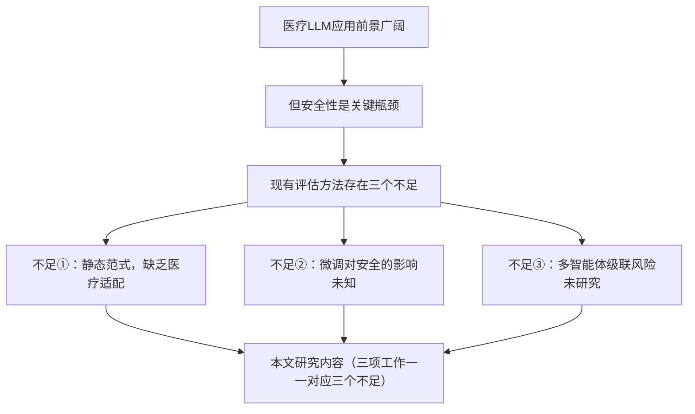
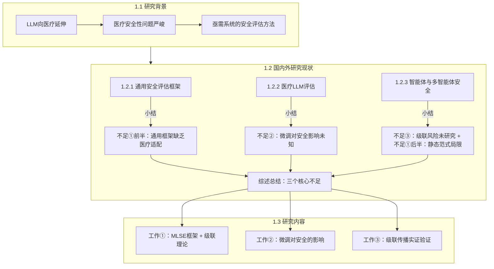

# 第一章（绪论）逻辑脉络诊断与修改建议

## 一、论文的核心论证主线（应有的逻辑）

根据摘要和全文结构，第一章应当完成一条清晰的论证链：

**核心逻辑**：背景引出问题 → 文献综述精确定位三个研究空白 → 研究内容一一回应三个空白。

---

## 二、当前各节的逐段诊断

### 2.1 研究背景（1.1节，第11-25行）

#### 当前内容结构
| 段落 | 内容 | 
|------|------|
| 第1段 | LLM总体进展 |
| 第2段 | 医疗LLM应用场景 |
| 第3段 | 安全性问题 + 人工评估困难 + 静态评估局限 + 智能体评估方向 |
| 第4段 | 总结性段落 |

#### 问题诊断

> [!WARNING]
> **问题1：第3段"一段话干了四件事"，逻辑过于压缩**
> 
> 第3段（第23行）是全章最严重的问题所在。这一段试图在单段内完成四个逻辑跳跃：
> 1. 安全性问题很重要 → 2. 人工评估不行 → 3. 自动化评估也不行（静态） → 4. 智能体方法有希望
> 
> 这四步中，步骤3→4的跳转尤其突兀。读者还没理解"静态评估为什么不行"，就被告知"智能体驱动是答案"。这里缺乏铺垫和论证。

> [!WARNING]
> **问题2：第4段总结突然引入"多智能体系统安全性"这一全新概念**
>
> 第25行的总结段落中，"多智能体系统层面的安全性已成为急需关注的新问题维度"凭空出现，前文没有任何铺垫。读者会困惑：前面一直在讨论单模型的安全评估，为什么突然跳到多智能体系统？

> [!NOTE]
> **问题3：背景节承担了过多论证任务**
>
> 研究背景节应当定位于"勾勒大图景、引出问题"，但目前它不仅引出了问题，还开始论证解决方案（智能体方法），甚至触及了多智能体系统安全。这些内容应当分别放在文献综述和研究内容节中。

---

### 2.2 国内外研究现状（1.2节）

#### 当前三小节的结构

| 小节 | 标题 | 综述内容 | 节末小结指出的不足 |
|------|------|----------|-------------------|
| 1.2.1 | 大语言模型安全性评估 | HELM/HarmBench等框架 + 红队技术 | 不足①通用框架缺医疗适配 + 不足③静态执行机制 |
| 1.2.2 | 医疗大语言模型评估 | MultiMedQA/Med-HALT等基准 | 不足①单次交互 + 不足②缺乏对抗性评估 |
| 1.2.3 | 智能体安全性评估 | AgentHarm/Agent-SafetyBench + 级联效应 | 不足①②③三个不足全部出现 |

#### 问题诊断

> [!CAUTION]
> **核心问题：三个"不足"反复出现、分散陈述，未形成递进式聚焦**
> 
> 三个小结段落（第52、62、74行）都在反复提及类似的不足，但措辞和侧重点每次都略有不同，导致读者无法清晰判断到底有几个核心研究空白、每个空白的精确边界是什么。
> 
> 具体表现：
> - **"静态评估范式的局限"在1.2.1和1.2.3中重复论证**，1.2.1小结说"依赖预先定义的静态测试脚本"，1.2.3小结又说"评估框架本身仍延续传统的静态基准测试范式"。
> - **"智能体驱动评估"的技术可行性论证**出现在1.2.3正文第72行，但这实际上是解决方案的论证，不应该出现在文献综述中。文献综述应止于"指出空白"，而不是开始论证"如何填补空白"。
> - **不足②（微调对安全的影响）在三个小结中的定位模糊**：1.2.1没有提到，1.2.2隐晦提及"缺乏对抗性威胁的评估"，1.2.3完全没有涉及。微调这个不足在综述中几乎没有专门的文献支撑段落。

> [!WARNING]
> **问题4：1.2.3"智能体安全性评估"的定位不够精准**
> 
> 这一节标题是"智能体安全性评估"，但实际内容混合了三个不同议题：
> 1. 智能体技术概述（第66行）—— 这更像是第二章"相关技术"的内容
> 2. 智能体作为被评估对象的安全问题（第68-70行）
> 3. 智能体作为评估工具的可行性（第72行）—— 这是解决方案论证，不是文献综述
> 
> 三个议题混在一起，读者很难抓住重点。

> [!WARNING]
> **问题5：不足②缺乏独立的文献综述支撑**
> 
> "领域微调对安全的影响"是三大不足之一，但在综述中，没有任何一个小节专门综述"微调/对齐/安全对齐"相关的文献。这个不足在第83行研究内容部分突然出现，显得缺乏文献基础。
> 实际上，关于微调对安全的影响，有"alignment tax"、"safety-capability trade-off"等文献可以综述，但当前完全缺失。

---

### 2.3 本文研究的主要内容（1.3节，第76-93行）

#### 问题诊断

> [!NOTE]
> **问题6：三个不足的总结（第79-85行）与前面综述小结高度重复**
> 
> 第79-85行将三个不足再次完整陈述了一遍，但这些内容在1.2.1/1.2.2/1.2.3的小结中已经各自出现过。读者读到这里已经是第二（甚至第三）次看到相同的观点。
> 
> 建议：如果综述小结已经充分铺垫，这里只需一句话回顾即可，重心放在研究内容上。

> [!NOTE]
> **问题7：研究内容的措辞偏长，可以更精练**
> 
> 三段研究内容（第89-93行）每段都试图同时说清楚"做什么"和"怎么做"和"为什么这样做"，导致段落冗长。绪论中的研究内容应以"做什么"为主，技术细节留给后续章节。

---

## 三、修改方案

### 3.1 研究背景（1.1节）—— 精简聚焦，只负责"引出问题"

修改目标：三段完成三步，干净利落。

| 段落 | 职责 | 要点 |
|------|------|------|
| 第1段 | LLM进展 + 向医疗延伸 | 合并当前第1-2段，精简 |
| 第2段 | 医疗安全性问题的严峻性 | 保留Awasthi/Singhal的数据，强调"安全评估不足" |
| 第3段 | 引出"亟需系统的安全评估方法" | 只点明需求，不论证解决方案。删除智能体方法的论证和多智能体系统的提法 |

**关键改动**：
- 删除第23行中关于"基于智能体的评估方法"的整段论证，移入1.2.3
- 删除第25行中"多智能体系统层面的安全性"的提法，移入1.2.3小结
- 最后一句改为类似："因此，如何构建面向医疗场景的系统化安全评估方法，已成为推动医疗大语言模型可信应用的迫切需求。"

---

### 3.2 国内外研究现状（1.2节）—— 重构综述逻辑，消除重复

**调整策略**：每个小节负责铺垫一个"不足"，小结段只指出该节对应的空白，不越界。

#### 1.2.1 大语言模型安全性评估（对应不足①的"通用框架"部分）

- 正文保持：HELM/HarmBench等通用框架 + 红队技术
- **小结只聚焦一个不足**：这些框架面向通用场景，缺乏医疗领域的专业适配
- **删除**小结中关于"静态执行机制"的论述（移入1.2.3）

#### 1.2.2 医疗大语言模型评估（对应不足②）

- 正文保持：MultiMedQA/Med-HALT等医疗基准
- **新增**：补充关于领域微调与安全对齐之间矛盾（alignment tax/safety-capability trade-off）的文献综述段落，为不足②提供文献基础
- **小结聚焦不足②**：现有医疗评估聚焦于准确性，对领域微调是否削弱安全对齐缺乏研究；评估形式以单次问答为主，难以覆盖多轮临床场景

#### 1.2.3 智能体与多智能体系统安全性评估（对应不足③ + 不足①的"执行机制"部分）

- **删除**智能体技术概述段落（第66行），移入第二章
- 正文保持：AgentHarm/Agent-SafetyBench/级联效应等
- **新增**：将"静态评估范式的局限"论证从1.2.1移入此处，与"智能体作为评估工具"的可行性论证整合，形成"问题→方向"的完整逻辑
- **小结聚焦不足③**：多智能体医疗系统的级联风险未得到定量研究 + 现有评估框架本身未能利用智能体能力突破静态范式

#### 1.2节末尾新增总结段

在三个小节之后，新增一段精炼的总结，将三个不足清晰列举：

> 综合上述三个方面的文献分析，可以归纳出当前研究的三个核心不足：（1）...；（2）...；（3）...。

这段话只出现一次，取代当前分散在各处的重复总结。

---

### 3.3 本文研究的主要内容（1.3节）—— 删除重复，精练表达

- **删除**第79-85行的三个不足重述（因为1.2末尾的总结段已经完成了这个工作）
- 直接以一句话过渡："针对上述三个不足，本文开展以下研究工作："
- 三段研究内容保持一一对应，但精简技术细节

---

### 3.4 修改后的逻辑流程图

---

## 四、优先级建议

| 优先级 | 修改项 | 影响 |
|--------|--------|------|
| 🔴 高 | 消除三个小结段的重复论证，统一到1.2末尾 | 解决最核心的"混乱感" |
| 🔴 高 | 精简1.1第3段，删除解决方案论证和多智能体提法 | 让背景节职责明确 |
| 🟡 中 | 1.2.2补充微调-安全对齐的文献段 | 为不足②提供文献基础 |
| 🟡 中 | 1.2.3删除智能体技术概述，重新组织 | 让综述更聚焦 |
| 🟢 低 | 精简1.3研究内容的措辞 | 提升可读性 |
